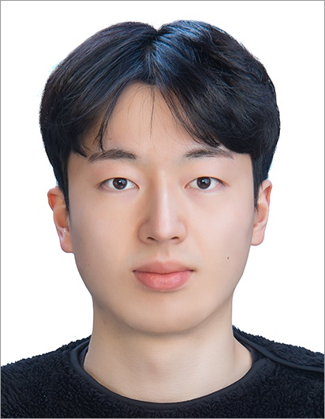
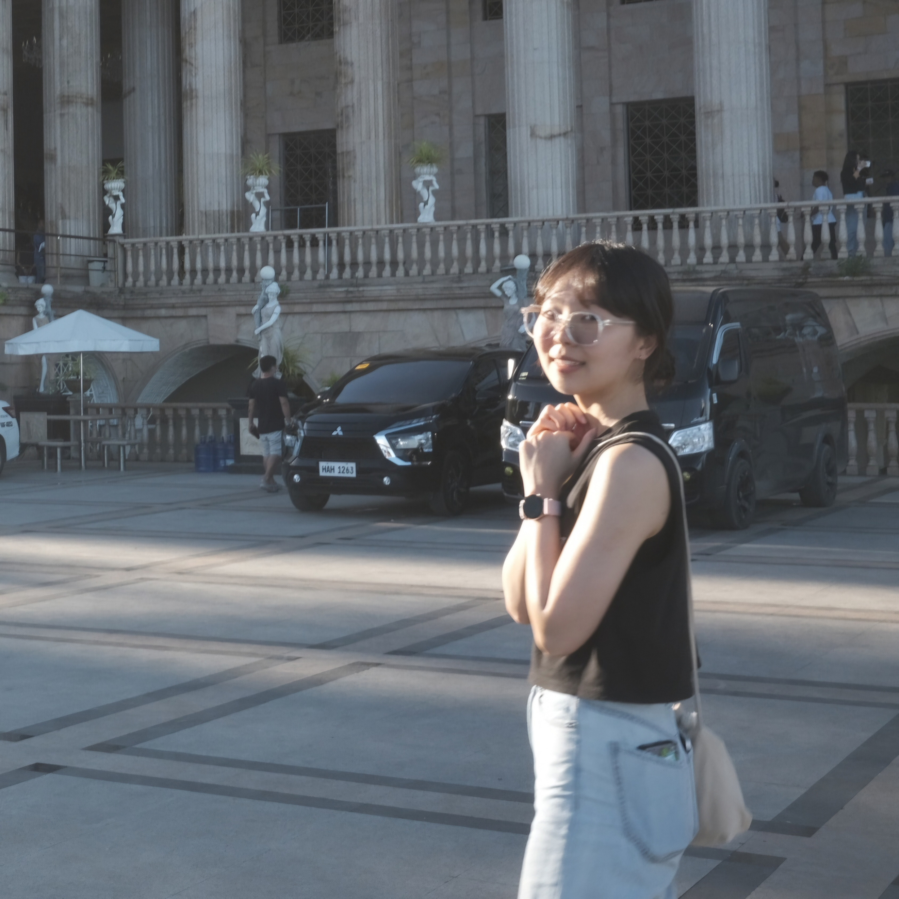

# AI Segmentation & Inpainting 기반 자율주행 차량 카메라 센서 데이터 복원 시스템

## 프로잭트 소개

**자율주행 시뮬레이터를 활용한 Segmentation & Inpainting 기반 카메라 센서 데이터 복원 시스템**

자율주행 차선 인식 ADAS(ex. LKA, LFA, HDA) 사용 중 카메라 센서에 오염이 발생할 경우 운전 중인 사람의 눈을 가리는 것과 마찬가지로 안전에 매우 치명적일 수 있습니다. 이와 관련하여 시장에 나와있는 솔루션은 단순 자율주행 비활성화 뿐입니다. 23년 9월 현대자동차,기아가 하드웨어적으로 이를 해결하기 위한 ‘로테이터캠’을 특허 등록했지만 차량 제조 단가, 디자인 등의 문제로 상용화에는 어려움이 있습니다. 따라서 이를 소프트웨어적으로 해결하는 방법을 고려하게 되었습니다.

## 소개 자료

- 소개 영상
- 소개 페이지
- 중간 발표 PDF

## 팀 소개
|"|  |  |  |  |
| :---: | :---: | :---: | :---: | :---: |
| **조규현** | **박준석** | **변준형** | **오준호** | **이세현** |
| ****1669 | ****1271 | ****1606 | ****1626 | ****3043 |
| wrg0731@kookmin.ac.kr | 20191271@kookmin.ac.kr | junhyeong0519@kookmin.ac.kr |ojunho7535@gmail.com | lifethis21@kookmin.ac.kr |
| [Kyuhyun-Cho](https://github.com/Kyuhyun-Cho) | [jjunseoki](https://github.com/jjunseoki) | [Byeooon](https://github.com/Byeooon) | [ojunho](https://github.com/ojunho) | [sehyeon518](https://github.com/sehyeon518) |

## 사용법

소스코드제출시 설치법이나 사용법을 작성하세요.

## 기타

추가적인 내용은 자유롭게 작성하세요.

